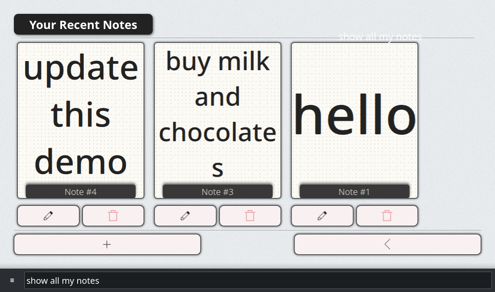
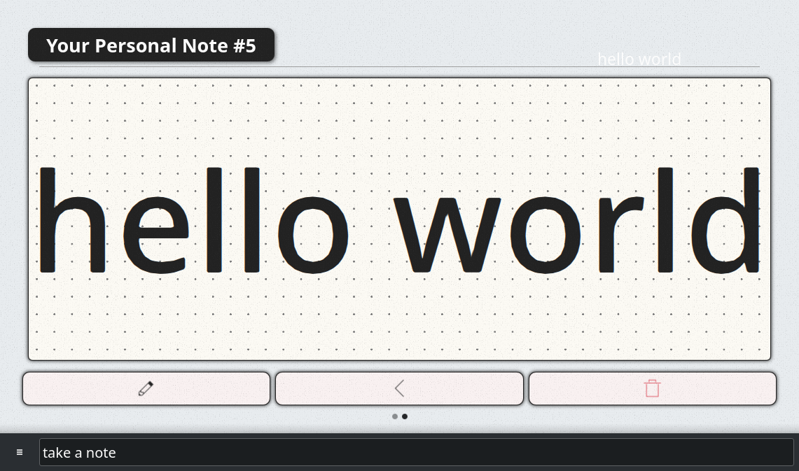

#  Notes
Take personal notes to keep track of appointments, to-do items, etc.

 

## About
Use OVOS when your hands are busy and you want to quickly take a note.

## Examples
* "Take a note"
* "Show all my notes"
* "Read my last 3 notes"
* "Read my first 3 notes"
* "Read my last note"
* "Read all my notes"
* "Delete / Remove note (number)"

## Credits
Aix (@AIIX)

## Category
**Daily**

## Tags
#notes
#productivity
