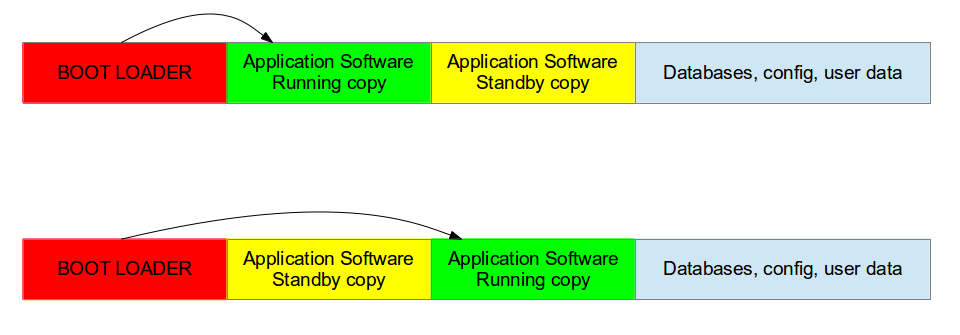
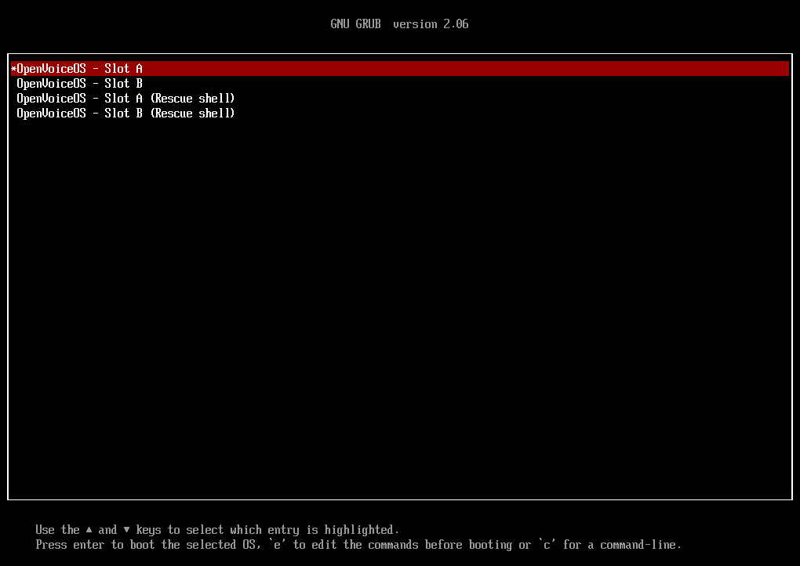

# Technical system architecture

## Disk image build up

The system uses a so called "Double copy with fall-back" architecture. Also known as "A/B (seamless) system updates". This system guarantess that there is always a working copy even if the softwre update is interrupted or a power off occurs.
Each of these A/B copies contains a linux kernel within it's root file system, which is read only and compressed by utilizing squashfs. At current time the rootfs disk usage is ~300MB.



A synergy with the boot loader is necessary, because the boot loader must decide which copy should be started. It must be possible to switch between the two copies. After a reboot, the boot loader decides which copy should run.
A seperate overlay partition for all changeable files is used to make the userspace system read/write. This seperate partition can be overlayed over either active rootfs partitions, being it slot A or slot B. A factory reset can therefor also being easliy obtained by resetting that overlay partition. It will then again start with the files shipped within the read only squashfs partition.
All docker containers and OVOS framework associated configuration files are stored with the users HOME directory which again is a seperate partition at the end of the disk which is also auto extended over the full size of the disk at boot. This is done based on the availability of free unused disk space at boot. (Any boot, being it the first or any consecutive boot)

## Partition layout

The partition table is written using GPT where possible. Boards/ systems that do not (yet) support GPT, a hybrid system is used. MBR to be able to boot from the ESP bootable partion and from there on GPT takes over again.
The disk image partitions/ partition table is build up as followed;

- ESP (EFI System Partition); VFAT formatted, 16 MB in size and containes the UEFI stub and GRUB2 boot loader.
- ROOTFS-1; Compressed SquashFS filesystem partion, 512 MB in size and containes the linux root system Slot-A including the kernel within the /boot folder.
- ROOTFS-1; Compressed SquashFS filesystem partion, 512 MB in size and containes the linux root system Slot-B including the kernel within the /boot folder.
- OVERLAYFS; Ext4 formatted, 256 MB in size used to persistant store files. Mostly /etc, /root and /var/log directories.
- HOMEFS; Ext4 formatted, 64 MB in size out of the box, however being extended over the unused disk space. A minimum of 8 GB as disk size is recommended.

A visual representation looks like this:

```text
-------------------------
|         ESP           |
-------------------------
|       ROOTFS-1        |
|                       |
-------------------------
|       ROOTFS-2        |
|                       |
-------------------------
|      OVERLAY-FS       |
-------------------------
|        HOMEFS         |
|                       |
|                       |
...
-------------------------
```

## ESP Boot system

The system uses UEFI boot stubs to launch the GRUB2 boot loader. The GRUB2 boot loader takes care of booting the active system partition or can be used to either switch/ roll back to the other system partition or boot into rescue mode for both these system partitions.


