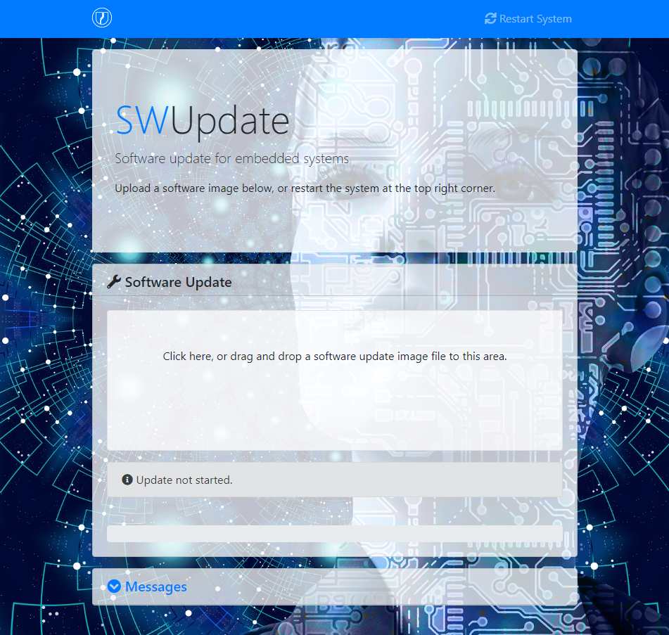

# Technical features and capabilities

## Updating the system

The system is using the SWUpdate system to seamlessly update and switch between Slot-A and Slot-B. An firmware update file basically contains a new version of the rootfs but can also include seperate files for either the overlay partion or even to update files within the HOME partition/ directory if required.
SWupdate files are using the .swu extension (SoftWare Update) and are basically CPIO images that can contain one or multiple rootfs images and/ or files. In addition, it also contain a sw-description file with meta information about the update.

A visual representation of this CPIO image looks like this:

```text
-------------------------
|      CPIO Header      |
-------------------------
|    SW-Description     |
-------------------------
|        ROOTFS         |
|                       |
-------------------------
...
-------------------------
|      OPTIONAL:        |
|      Any files        |
-------------------------
```

The SW-Description contains information about supported hardware and software. This way it is NOT possible to use an OVA firmware update file on for instance a Raspberry Pi device.

Updates can be applied by using the following multiple methods:
- From USB drive connected with a firmware .swu file.
- Uploading a firmware .swu file to the device using a on-device webpage (more on that method below).
- Downloading a firmware .swu file from a webserver
- Push/Pull from a fleet management server using Hawkbit. (Planned for stable updates in the future)


### Streaming updates

Because we make use of a mirrored Slot A/B update architecture and therefore it will always be possible to boot into the other Slot and/ or recovery mode, updates are streamingly applied. Therefore no additional free space is required to first upload/download the firmware update image to the device. The update is applied as it is being uploaded/ downloaded.

### On-device webbased updates

If you browse to your device with a webbrowser pointing toward port 8080 (Example; http://192.168.16.144:8080/ ) you will be greeted by a simple webpage that can be used to update your system.



Either drag and drop a firmware update .swu file or click the box to browse to the firmware update .swu to start the update process. The progress bar shows the update status, however if you would like to see more verbose output you can open/ extend the messages box aqt the bottom of the page.
When everything went right, your device will reboot into the other updated slot. Fall over mechanisms are in place. If it can not boot into the just update system slot, it will revert back and boot into the old system slot.
